<div align="center">

<!-- 3D ASCII Wordmark Header Banner -->


<br/>

<sub><code>pallavithegod@github</code>:<code>~$</code> whoami</sub>

### **Backend & AI-Agent Engineer**
Building the infrastructure layer behind automation: auth, credential vaults, deployment monitoring, and multi-agent pipelines.

📍 **Delhi, India** &nbsp;·&nbsp; 🌐 [Portfolio](https://pallavijain.vercel.app) &nbsp;·&nbsp; 💼 [LinkedIn](https://www.linkedin.com/in/pallavii-) &nbsp;·&nbsp; 🐦 [X / Twitter](https://x.com/Pallavi_jain06)

</div>

<br/>

```text
pallavithegod@github:~$ fastfetch
```

```text
pallavithegod@github
--------------------
. OS: ................................ GitHub Profile / Linux x86_64
. Status: ............................ 364 contributions this year
. Host: .............................. Open source community
. Kernel: ............................ Public GitHub profile (pallavithegod)
. IDE: ............................... VS Code, Neovim, Terminal
. Languages.Programming: ............ JavaScript (ESNext), TypeScript, Python 3.12, SQL
. Languages.Real: .................... English, Hindi
. Architecture: ...................... Multi-Agent Pipelines, Event Loops, ACID Stores, Microservices

- Contact -------------------------------------------------------------
. GitHub: ............................ github.com/pallavithegod
. Website: ........................... pallavijain.vercel.app
. LinkedIn: .......................... linkedin.com/in/pallavii-
. Twitter / X: ....................... @Pallavi_jain06
. Location: .......................... Delhi, India

- GitHub Stats & Telemetry --------------------------------------------
. Repos: ............................. 25 public repositories
. Stars Earned: ...................... 22+ stars
. Annual Contributions: .............. 364 units
. Current Focus: ..................... Scalable Backend Systems & Autonomous AI-Agent Workflows
. Role Status: ....................... Open to Backend / AI-Agent Engineering roles

Palette:   ███   ███   ███   ███   ███   ███   ███   ███
```

<br/>

```text
pallavithegod@github:~$ cat about.md
```

I work close to the systems layer — engineering services that manage credentials, monitor deployments, and coordinate autonomous AI agents, rather than just calling an API and rendering the result.

- **Resilient Architectures**: I'd rather ship one robust system that holds up under real production traffic than five fragile demos that fail under load.
- **Backend Core**: Deeply comfortable across Node.js/Express and Python/FastAPI architectures, designing secure APIs, schedulers, and fault-tolerant background queues.
- **Cloud & Orchestration**: Experience shipping and orchestrating production stacks across both **AWS** and **Azure** container environments.

<br/>

```text
pallavithegod@github:~$ ls skills/
```

<table>
<tr>
  <td width="20%"><b>Languages</b></td>
  <td>
    
    
    
    
    
  </td>
</tr>
<tr>
  <td width="20%"><b>Backend &amp; Agents</b></td>
  <td>
    
    
    
    
    
  </td>
</tr>
<tr>
  <td width="20%"><b>Cloud &amp; Infra</b></td>
  <td>
    
    
    
    
  </td>
</tr>
<tr>
  <td width="20%"><b>Data &amp; Persistence</b></td>
  <td>
    
    
    
  </td>
</tr>
</table>

<br/>

```text
pallavithegod@github:~$ ls projects/ --sort=impact
```

### ⚡ Featured Systems & Core Builds

#### 🔹 [RecallOps — Node Backend](https://github.com/pallavithegod/ima-agent-backend-node)
> Autonomous deployment monitoring and credential management engine.
- Auth vault with provider tokens encrypted per user using **AES-256-GCM** before persistent storage.
- Monitoring scheduler that polls GitHub, Vercel, and Render, automatically detects failed builds, diagnoses error traces, and triggers self-healing remediation jobs.
- **Stack**: `Node.js` &bull; `Express` &bull; `Firebase` &bull; `SQLite` &bull; `Azure App Service`

#### 🔹 [Multi-Step Research Agent](https://github.com/pallavithegod/research-agent)
> An x402-native deep research agent with evidence verification pipelines.
- Supports **Quick**, **Deep**, and **Compare** investigation modes with rigorous source-policy enforcement and automated evidence-quality confidence scoring on generated reports.
- Full-stack microservices architecture: Next.js analytical dashboard paired with an asynchronous FastAPI engine.
- **Stack**: `Next.js` &bull; `FastAPI` &bull; `Azure Container Apps` &bull; `MongoDB Atlas` &bull; `Clerk`

#### 🔹 [CommitVault — Banking App Backend](https://github.com/pallavithegod/CommitVault-Backend)
> Enterprise-grade relational database architecture & core transactional banking server.
- Demonstrates enterprise SQL integrity: views with correlated subqueries, stored procedures for atomic balance transfers, row-level locking inside strict ACID transactions, and automated audit triggers on account modifications.
- **Stack**: `Node.js` &bull; `Express` &bull; `MySQL` &bull; `AWS`

<br/>

#### 🤝 Selected Collaborations & Open Source

| Project | Description | Role / Stack |
| :--- | :--- | :--- |
| [DebtAI](https://github.com/garvit-arora/debtAI) | AI-driven financial intelligence dashboard — debt/expense tracking with an Azure OpenAI assistant and multilingual support | Collaborator &bull; `JavaScript` `Azure OpenAI` |
| [CoverFi](https://github.com/CoverFI-space) | Open-source Stellar/Soroban infrastructure for safer stablecoin payments and reserve-backed protection | Contributor &bull; `Rust` `Soroban` `Web3` |
| [Snake Noir](https://github.com/pallavithegod/Snake-Noir) | Classic arcade game rebuilt with custom mechanics, audio synthesis, and persistent score caching &bull; [Live Demo](https://snakenoir.netlify.app) | Solo Build &bull; `JavaScript` `HTML5 Canvas` |

<br/>

```text
pallavithegod@github:~$ ./telemetry --stream activity --pulse continuous
```

<!-- Rare, Unique Animated Terminal Sonar & Oscilloscope Contribution Visualizer -->
<p align="center">
  
</p>

<br/>

```text
pallavithegod@github:~$ curl -s api.pallavi/contact
```

```json
{
  "engineer": "Pallavi Jain",
  "handle": "pallavithegod",
  "portfolio": "https://pallavijain.vercel.app",
  "linkedin": "https://linkedin.com/in/pallavii-",
  "twitter": "https://x.com/Pallavi_jain06",
  "status": "open to backend / AI-agent engineering roles",
  "availability": "immediate"
}
```

<br/>

<div align="center">
  <sub><code>pallavithegod@github:~$</code> <span>&nbsp;▍</span></sub>
</div>
