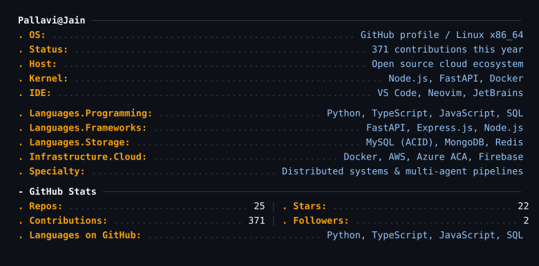
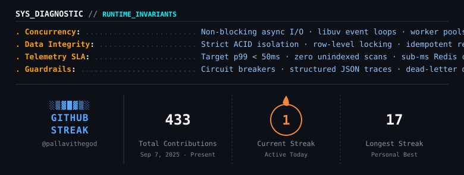

<!-- 3D ASCII Wordmark Header Banner -->

 

<!-- Colored Terminal Typing Prompt -->

  

<!-- Terminal Status Telemetry Cards -->

&nbsp;

&nbsp;

&nbsp;

&nbsp;

## <code>runtime.spec()</code>

  

  

 

## <code>tech.arsenal</code>

 

## <code>featured.systems</code>

<table align="center" width="100%">
<tr>
<td width="33%" valign="top">

### <code><a href="https://github.com/pallavithegod/ima-agent-backend-node">RecallOps</a></code>
> **Autonomous Deployment & Vault Engine**
- Credential vault encrypting user tokens with **AES-256-GCM** before persistent storage.
- Auto-polls GitHub, Vercel & Render; diagnoses failed traces and triggers self-healing tasks.
 

`Node.js` `Express` `Firebase` `Azure`

</td>
<td width="33%" valign="top">

### <code><a href="https://github.com/pallavithegod/research-agent">Research Agent</a></code>
> **x402-Native Evidence Pipeline**
- **Quick**, **Deep**, and **Compare** modes with source-policy enforcement and automated evidence confidence scoring.
- Asynchronous FastAPI backend paired with analytical Next.js dashboard.
 

`Next.js` `FastAPI` `Azure ACA` `MongoDB`

</td>
<td width="33%" valign="top">

### <code><a href="https://github.com/pallavithegod/CommitVault-Backend">CommitVault</a></code>
> **High-Concurrency Banking Server**
- Enterprise SQL integrity: correlated subqueries, atomic balance transfer stored procedures.
- Row-level locking inside strict **ACID transactions** with automated account audit triggers.
 

`Node.js` `Express` `MySQL` `AWS`

</td>
</tr>
</table>

| Collaboration | What it does | Stack |
| :--- | :--- | :--- |
| [DebtAI](https://github.com/garvit-arora/debtAI) | Financial intelligence dashboard with Azure OpenAI assistant & expense tracking | `JavaScript` `Azure OpenAI` |
| [CoverFi](https://github.com/CoverFI-space) | Stellar/Soroban smart contract infra for reserve-backed stablecoin payments | `Rust` `Soroban` `Web3` |
| [Snake Noir](https://github.com/pallavithegod/Snake-Noir) | Arcade classic rebuilt with audio synthesis, local caching & smooth canvas | `JavaScript` `Canvas` |

 

  

 

## <code>network.connect()</code>

<pre><code>- Contact &amp; Routing -------------------------------------------------------------
<b>. Email: </b>............................ <a href="mailto:jainpallavi.delhi@gmail.com">jainpallavi.delhi@gmail.com</a>
<b>. LinkedIn: </b>......................... <a href="https://www.linkedin.com/in/pallavii-">linkedin.com/in/pallavii-</a>
<b>. Twitter / X: </b>...................... <a href="https://x.com/Pallavi_jain06">@Pallavi_jain06</a>
<b>. Website: </b>.......................... <a href="https://pallavijain.vercel.app">pallavijain.vercel.app</a>
<b>. GitHub: </b>........................... <a href="https://github.com/pallavithegod">github.com/pallavithegod</a>
<b>. Location: </b>......................... Delhi, IN (IST / Remote)</code></pre>

 

&nbsp;

&nbsp;

&nbsp;

 

 

  

